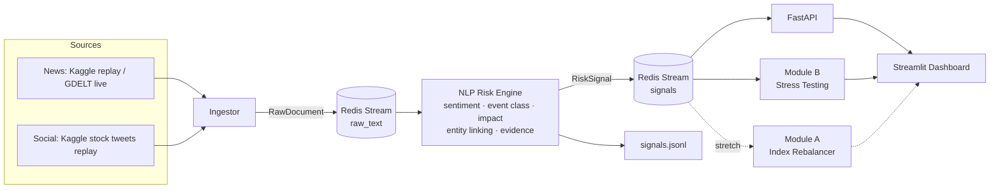

# Architecture

## Services (docker-compose)

| Service | Command | Status |
|---|---|---|
| redis | `redis:7-alpine` | ✅ |
| api | `uvicorn ripple.api.main:app` | ✅ skeleton |
| dashboard | `streamlit run src/ripple/dashboard/app.py` | ✅ skeleton |
| ingestor | `python -m ripple.ingestion.run` | Day 2–3 |
| engine | `python -m ripple.engine.worker` | Day 2 |
| stress_test | `python -m ripple.stress_test.worker` | Day 6–7 |

## Data contracts

See [`src/ripple/schemas.py`](../src/ripple/schemas.py): `RawDocument` (ingestor → engine) and `RiskSignal` (engine → consumers).
