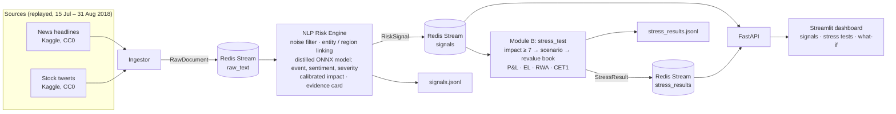

# Architecture

Offline (not part of the running stack): Colab notebook that distils an LLM teacher into the ONNX model (Day 4),
and scripts that calibrate impact against realised price moves (Day 5) and build the stress-scenario library.

## Services (docker-compose)

| Service | Command | Role |
|---|---|---|
| redis | `redis:7-alpine` | Message bus (Redis Streams with consumer groups) |
| ingestor | `python -m ripple.ingestion.run` | Replays the two sources on an accelerated clock; a restart starts a clean session |
| engine | `python -m ripple.engine.worker` | `RawDocument` → `RiskSignal` |
| stress_test | `python -m ripple.stress_test.worker` | `RiskSignal` (impact ≥ 7) → `StressResult` |
| api | `uvicorn ripple.api.main:app` | `/signals`, `/stress`, `/portfolio`, `/stats`, `/health` |
| dashboard | `streamlit run src/ripple/dashboard/app.py` | Live signals, stress tests, what-if scenarios |

## Data contracts

[`src/ripple/schemas.py`](../src/ripple/schemas.py): `RawDocument` (ingestor → engine), `RiskSignal` (engine →
consumers), `StressResult` (Module B → API/dashboard).

## Engine stages

| Stage | Module | How |
|---|---|---|
| Noise filter | `engine/relevance.py` | Drops template spam and social posts with no financial terms (~91% of company-tagged tweets) |
| Entity linking | `engine/entities.py`, `engine/regions.py` | Aliases and `$cashtags` → 30 tracked companies (never the dataset's unreliable ticker column). Market-wide news → the region it names (TURKEY, CHINA, EUROPE, INDIA, LATAM) or MARKET |
| Event, sentiment, severity | `engine/analyzers.py` | One distilled multi-task model (bge-small, int8 ONNX) trained on Qwen2.5-7B labels. Fallback: keyword rules + FinBERT (`NLP_BACKEND=rules`) |
| Buzz | `engine/impact.py` | Mentions in the last 24h vs the entity's trailing 7-day average, with a warm-up at replay start |
| Impact (1–10) | `engine/impact.py` | Logistic P(2-day abnormal move ≥ 2σ) from severity, sentiment, event, buzz and source; ≥ 7 = top 3% of history |
| Evidence | `schemas.Evidence` | Key phrases, each driver's contribution, source URL, model used |

## Module B

| Step | Module | How |
|---|---|---|
| Trigger | `stress_test/worker.py` | Impact ≥ 7; one test per scenario and target per 12h of simulated time |
| Scenario | `stress_test/scenarios.py` | Event type → historical episode (trade war 2019, lira crisis 2018, taper tantrum 2013) or issuer-specific shock; scaled by impact; re-targeted to the region in the headline |
| Revaluation | `stress_test/engine.py` | Duration/convexity, DV01, spread DV01, delta, FX translation; loan EL with spread-stressed PDs |
| Capital | `stress_test/engine.py` | Basel IRB credit RWA; CET1 ratio before/after |
