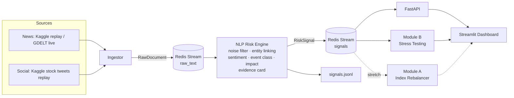

# Architecture

## Services (docker-compose)

| Service | Command | Status |
|---|---|---|
| redis | `redis:7-alpine` | ✅ |
| api | `uvicorn ripple.api.main:app` | ✅ `/health`, `/signals`, `/stats` |
| dashboard | `streamlit run src/ripple/dashboard/app.py` | ✅ live signals, sentiment, event mix, alerts + evidence |
| ingestor | `python -m ripple.ingestion.run` | ✅ replay mode |
| engine | `python -m ripple.engine.worker` | ✅ baseline (FinBERT + rules) |
| stress_test | `python -m ripple.stress_test.worker` | Day 6–7 |

## Data contracts

See [`src/ripple/schemas.py`](../src/ripple/schemas.py): `RawDocument` (ingestor → engine) and `RiskSignal` (engine → consumers).

## Engine stages (baseline, Day 2)

| Stage | Module | How |
|---|---|---|
| Noise filter | `engine/relevance.py` | Drops template spam and social posts with no financial terms (~91% of company-tagged tweets in the 2018 window) |
| Entity linking | `engine/entities.py` | Aliases + `$cashtags` from the text (the dataset's ticker column is unreliable) → 30-company universe, or `MARKET` for macro/geopolitical news |
| Sentiment | `engine/sentiment.py` | FinBERT (`ProsusAI/finbert`): P(positive) − P(negative) ∈ [−1, 1] |
| Event class | `engine/events.py` | Weighted keyword rules → 8 event types + confidence; matched phrases become evidence |
| Impact (1–10) | `engine/impact.py` | 0.35·severity×confidence + 0.35·\|sentiment\| + 0.30·buzz, × source credibility. Buzz = 24h mentions vs trailing 7-day average |

Upgrades: Day 4 replaces sentiment + event rules with a distilled multi-task model (ONNX); Day 5 calibrates impact against realised abnormal returns.
